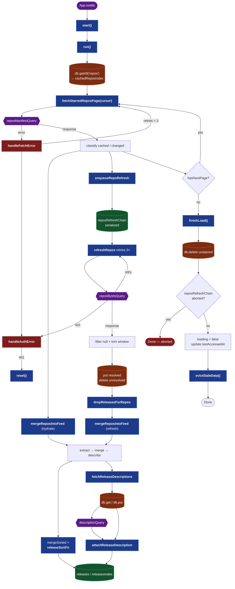

# Implementation

Incremental-sync pipeline. A cheap manifest pass enumerates every
starred repo (id + `updatedAt`); cached repos hydrate from IDB
immediately, only new or `updatedAt`-advanced repos are fetched in
full. `updatedAt` bumps on any repo metadata change — commits,
releases, release-note edits, description — so a single comparison
covers everything we care about.

**Legend**: blue = `Loader` method · orange = IDB · green = in-memory
state · purple = external · red = error.

## Invariants

- **Refresh batches serialized** via `reposRefreshChain` (GitHub secondary rate limit).
- **`refreshRepos` returns abort `boolean`** propagated through the chain;
  abort skips `lastAccessedAt` update + `evictStaleData`.
- **`lastAccessedAt` only bumps on success** — it marks the "all caught up" line.
- **Description cache keyed by `${releaseId}-${updatedAt}`** so edits auto-refresh.
- **Cached `releases.nodes` trimmed to a sliding 1-month window** on every write
  and during `evictStaleData`.
- **`evictStaleData` runs at most once per 24h** (gated by `lastEvictedAt`
  in localStorage) — orphaned description keys may linger that long but
  won't grow unbounded.
