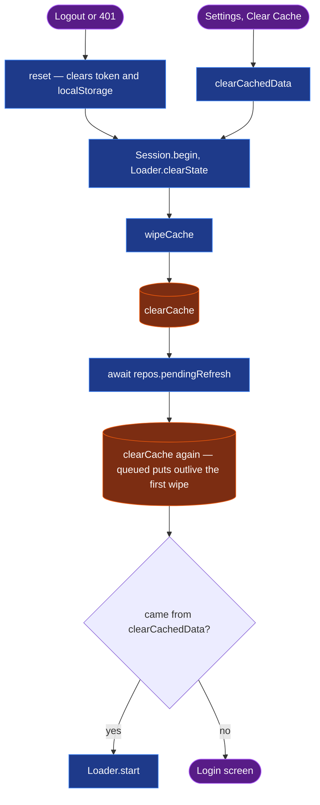

# Implementation

Incremental-sync pipeline. A cheap manifest pass enumerates every starred
repo (id + `updatedAt`); cached repos hydrate from IDB immediately, and
only new or `updatedAt`-advanced repos are refetched in full. `updatedAt`
bumps on repo metadata writes (pushes, description edits), so one
comparison per repo replaces a full refetch of the whole starred set.

Everything is threaded with a session id. `start()`, `reset()`, and
`clearCachedData()` all call `Session.begin()`, and every continuation after an
`await` calls `session.isStale(sessionId)` before touching shared state.

## Collaborators

`Loader` (`src/loader.svelte.ts`) is a façade: it constructs the graph below,
exposes the four values the UI reads, and owns the three entry points. Each
stage holds one job and only the dependencies it uses, and each lives in its own
flat module beside `loader.svelte.ts`.

| Unit              | Owns                                                 | Depends on                            |
| ----------------- | ---------------------------------------------------- | ------------------------------------- |
| `Session`         | octokit client, session id, `isStale`/`isSuperseded` | `settings`                            |
| `Status`          | `loading`, `toast`, progress counters, timings       | —                                     |
| `FeedStore`       | `releases` + indexes, `groups` derived               | `settings`                            |
| `RetryRunner`     | backoff, exhaustion toasts, 401 teardown             | `Session`, `Status`                   |
| `RepoSync`        | manifest pagination, serial refresh chain            | all of the above, `DescriptionSync`   |
| `DescriptionSync` | release notes per merged batch                       | `Session`, `FeedStore`, `RetryRunner` |
| `CacheEviction`   | the two once-a-day IDB sweeps                        | `Session`, `FeedStore`                |

Two edges are inverted so nothing points back at `Loader` except by callback:
`RetryRunner` gets an `onAuthFailure` hook (a 401 means the whole session goes),
and `RepoSync` gets an `onComplete` hook, which is the only path that reaches
`lastAccessedAt` and eviction. `FeedStore.merge()` returns the releases that
landed rather than kicking off description fetches itself, which keeps the feed
independent of the network stages.

The **Disable Repo Cache** setting (`settings.disableCache`) swaps the manifest
pass for `reposFullQuery`, which pages whole repositories 20 at a time — the
pre-incremental-sync behaviour. Those nodes arrive complete, so they skip the
`repos` store entirely in both directions: no `getAll` hydration, no refresh
batches, no writes — and `CacheEviction` clears the store outright, so a
snapshot left by an earlier cached load can't be served once the toggle goes
back off. Description caching is unaffected; its keys embed `updatedAt`, so
they can't serve stale notes.

## Load pipeline

```mermaid
flowchart TD
  classDef fn fill:#1e3a8a,stroke:#3b82f6,color:#fff
  classDef io fill:#7c2d12,stroke:#ea580c,color:#fff
  classDef state fill:#14532d,stroke:#22c55e,color:#fff
  classDef ext fill:#581c87,stroke:#a855f7,color:#fff
  classDef err fill:#7f1d1d,stroke:#ef4444,color:#fff

  Start([App.svelte onMount]):::ext --> startFn["Loader.start — Session.begin"]:::fn
  startFn --> runFn["RepoSync.run"]:::fn
  runFn --> idbLoad[("db.getAll repos → cachedReposIndex, skipped when cache disabled")]:::io
  idbLoad --> fetchPage

  fetchPage["fetchStarredReposPage cursor"]:::fn --> requestPage["requestStarredReposPage"]:::fn
  requestPage --> gqlManifest{{"reposManifestQuery, or reposFullQuery when cache disabled"}}:::ext
  gqlManifest -->|401| handleAuthError
  gqlManifest -->|error| nextRetry["RetryRunner.run + retryDelay"]:::err
  nextRetry -->|retries less than 3| fetchPage
  nextRetry -->|exhausted| AbortEnd
  gqlManifest -->|response| processPage["processStarredReposPage"]:::fn

  processPage --> nextCheck{"hasNextPage and rateLimit left?"}
  nextCheck -->|yes| fetchPage
  processPage --> classify["isFullRepo, else repoNeedsRefresh per node"]:::fn
  classify -->|full node, cache disabled| processHydrate["mergeIntoFeed hydrate"]:::fn
  classify -->|cached and unchanged| processHydrate
  classify -->|new or changed| enqueueRefresh["enqueueRefresh in batches of 20"]:::fn
  nextCheck -->|no next page| finishLoad
  nextCheck -->|rate limit exhausted| RateLimitEnd([Drain chain, stop, no caught-up marker]):::err

  enqueueRefresh --> refreshChain[("RepoSync.refreshChain serialized")]:::state
  refreshChain --> runRefreshBatch["runRefreshBatch awaits previous"]:::fn
  runRefreshBatch --> refreshRepos["refreshRepos retries 3x"]:::fn
  refreshRepos --> gqlBatch{{"reposByIdsQuery"}}:::ext
  gqlBatch -->|401| handleAuthError
  gqlBatch -->|error| refreshRepos
  gqlBatch -->|response| trimResolved["filter nulls, trim to 1-month window"]
  trimResolved --> idbBatchWrite[("put resolved, delete unresolved")]:::io
  idbBatchWrite --> dropForRepos["feed.dropForRepos"]:::fn
  dropForRepos --> processRefresh["mergeIntoFeed refresh"]:::fn

  processHydrate --> extract
  processRefresh --> extract
  extract["extractReleases, in-window only"]:::fn --> mergeSorted["mergeSorted with releaseSortFn"]:::fn
  mergeSorted --> releasesState[("FeedStore: releases, releasesIndex, releasesByRepo")]:::state
  releasesState --> groupsState[("groups derived, caught-up divider")]:::state
  extract --> loadDescriptions["descriptions.load, fire and forget"]:::fn
  loadDescriptions --> descCache[("db.get descriptions")]:::io
  descCache -->|hit| attachDesc["feed.attachDescription"]:::fn
  descCache -->|miss, batches of 20| fetchBatch["fetchBatch retries 3x"]:::fn
  fetchBatch --> gqlDesc{{"descriptionQuery"}}:::ext
  gqlDesc --> cacheDesc[("db.put descriptions")]:::io
  cacheDesc --> attachDesc
  attachDesc --> releasesState

  finishLoad["RepoSync.finishLoad"]:::fn --> staleIdb["deleteUnstarredRepos"]:::fn
  staleIdb --> staleIdbIo[("db.delete unstarred")]:::io
  staleIdbIo --> drain{"refreshChain aborted?"}
  drain -->|yes| AbortEnd([Done — aborted]):::err
  drain -->|no| markDone["loading false, then Loader.completeLoad persists lastAccessedAt"]
  markDone --> evictStaleData["CacheEviction.run"]:::fn
  evictStaleData --> cacheOff{"cache disabled?"}
  cacheOff -->|yes, every load| clearRepos[("clearRepos")]:::io
  clearRepos --> gate
  cacheOff -->|no| gate{"evicted in the last 24h?"}
  gate -->|yes| SuccessEnd([Done])
  gate -->|no, cache enabled| evictRepos["evictStaleRepos, trim to window"]:::fn
  evictRepos --> evictDescs
  gate -->|no, cache disabled| evictDescs["evictStaleDescriptions, survivors from the feed"]:::fn
  evictDescs --> SuccessEnd

  handleAuthError["handleAuthError 401"]:::err --> resetFn["onAuthFailure → Loader.reset"]:::fn
```

## Teardown

```mermaid
flowchart TD
  classDef fn fill:#1e3a8a,stroke:#3b82f6,color:#fff
  classDef io fill:#7c2d12,stroke:#ea580c,color:#fff
  classDef ext fill:#581c87,stroke:#a855f7,color:#fff

  Logout([Logout or 401]):::ext --> resetFn["reset — clears token and localStorage"]:::fn
  ClearBtn([Settings, Clear Cache]):::ext --> clearFn["clearCachedData"]:::fn
  resetFn --> bump["Session.begin, Loader.clearState"]:::fn
  clearFn --> bump
  bump --> wipeCache["wipeCache"]:::fn
  wipeCache --> clear1[("clearCache")]:::io
  clear1 --> awaitChain["await repos.pendingRefresh"]:::fn
  awaitChain --> clear2[("clearCache again — queued puts outlive the first wipe")]:::io
  clear2 --> restart{"came from clearCachedData?"}
  restart -->|yes| startAgain["Loader.start"]:::fn
  restart -->|no| Idle([Login screen]):::ext
```

**Legend**: blue = pipeline method · orange = IDB · green = in-memory
state · purple = external · red = error.

## Invariants

- **Refresh batches serialized** via `RepoSync.refreshChain` (GitHub secondary
  rate limit). Manifest pages and description batches run in parallel.
- **`refreshRepos` returns an abort `boolean`** propagated through the
  chain; abort skips `onComplete`, and so both the `lastAccessedAt` update
  and eviction.
- **`lastAccessedAt` only bumps on success** — it marks the "all caught
  up" line. It is written to localStorage but not to the in-memory
  `settings`, so the divider doesn't jump mid-session.
- **`refreshChain` resets to `Promise.resolve(false)`** in `RepoSync.clear`,
  which `Loader.clearState` calls; a chain left resolved `true` by an earlier
  abort would short-circuit every batch of the next load.
- **Description cache keyed by `${releaseId}-${updatedAt}`** (via
  `descriptionKey`) so edited release notes auto-refresh. Writes key on
  the release's own `updatedAt`, not the one `descriptionQuery` returns —
  reads and eviction both key on the cached value.
- **Cached `releases.nodes` trimmed to a sliding 1-month window** on every
  refresh write and again during `CacheEviction.run`. `isReleaseInWindow`
  (`src/release_window.ts`) is the single definition of that edge.
- **`releasesByRepo`** maps repo id → release ids so `FeedStore.dropForRepos`
  is O(batch) rather than O(feed) before each re-merge.
- **`Status.advance` is called with the full batch size** on refresh (not the
  resolved count) so progress reaches 100% even when ids resolve to null.
  `progress` is clamped to 1 because concurrent star changes can overshoot.
- **Eviction sweeps each store on its own terms.** `evictStaleRepos` trims
  aged-out releases out of cached repo rows (never deleting rows —
  `deleteUnstarredRepos` owns that); `evictStaleDescriptions` deletes every
  key the loaded feed doesn't reference. Deriving survivors from the feed
  rather than the `repos` store is what makes it correct with the cache
  disabled, where that store is never written.
- **With the cache disabled, `CacheEviction.run` clears `repos` instead of
  trimming it** — the store is a snapshot the load ignored, so it must not
  outlive it.
- **`clearRepos` is the only ungated step** — it's a single cheap
  `store.clear()` and the ignored snapshot must not survive the load. Both
  sweeps sit behind the 24h `lastEvictedAt` gate, since each walks an entire
  store; orphaned keys may linger that long but won't grow unbounded.
- **Description failures don't tear down the load.** `DESCRIPTION_RETRY_POLICY`
  has `fatal: false`, so `RetryRunner` toasts on exhaustion without clearing
  `loading`, unlike `REQUEST_RETRY_POLICY`.
